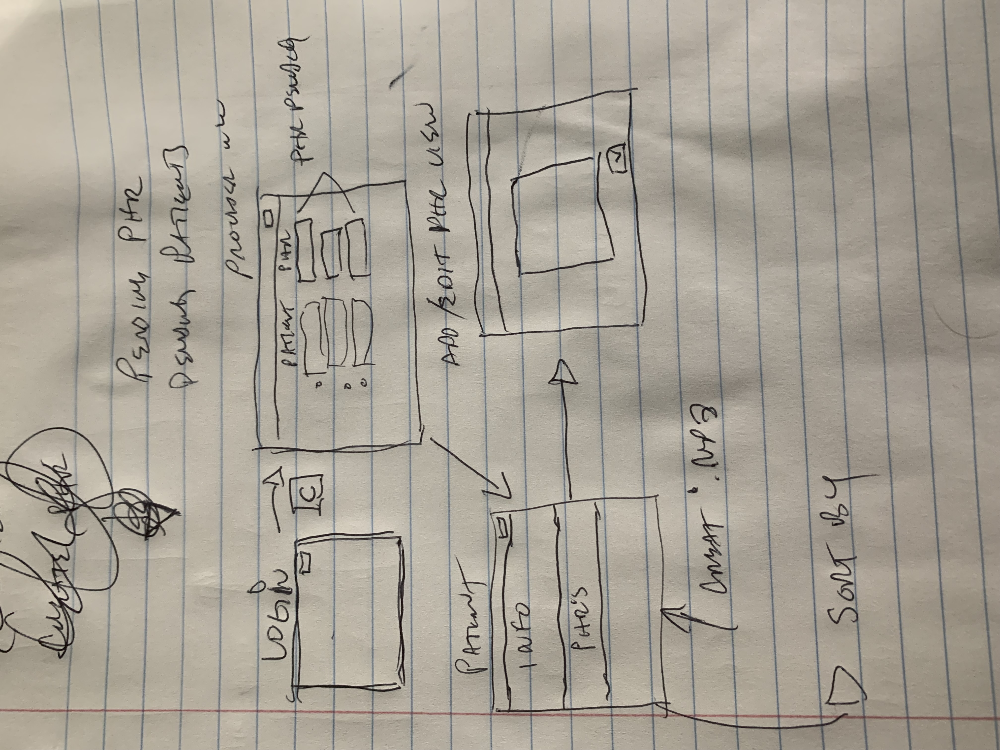

# Design Document

## Y.O.D.A. MD Design

## 1. Problem Statement

Doctors and support staff can spend a cumulative 3-4 hours a day in post appointment dictations and data entry. The process is fraught with potential pitfalls which can cause patient harm and expose liability. Tools are available that can benefit providers retention of patient details, reduce transcription mistakes and give time and attention back to patients in visit to increase value of care. 

By recording visits in real time  and  combining dictated in room & post visit dictation together, parsing that audio into text could provide a value add suite of low provider cost services that can automate the transcription, summarization and patient record / EHR update process.

The problem space is a perfect match for an AWS Lambda Serverless scaling solution stack composed of a Cloudfront Provider Portal connected to patient to EHR's stored in DynamoDB. The portal will allow the provider to see, view and edit patient details, but more importantly record patient interactions via device microphone which will be retained in S3 buckets and converted to conversational text via Amazon Medical Transcribe. 

Further, provider notes can be attached for full S.O.A.P. attribute style note taking and all relevant medical information summarized via Amazon Comprehend. This could potentially be used as well to extend this design to parse relevant patient details updating the EHR in the DynamoDB tables if the MVP is satisfied with sprint time remaining.

## 2. Use Cases

U1. _As a YODA provider, I want to securely log into to privileged patient EHR information._

U2. _As a YODA provider, I want to view historical patient health record and past provider notes on one screen._

U3. _As a YODA provider, I want to create patient visit records and attach dictation._

U4. _As a YODA provider, I want to edit discrepancies in the patient health record and provider dictated notes._

U5. _As a YODA provider, I want to sort PHR's of a patient by date or date range._

U6. _As a YODA provider, I want to see previous PHR's of a patient by id._

U7. _As a YODA provider, I want to see all the pending Patients & PHR's for provider for current day._

U8. _As a YODA provider, I want to create in room audio of patient doctor interaction to replace dictation._

U9. _As a YODA provider, I want to add another audio file to be dictated to text and to update dictation to the patient visit record notes._

## 4. Project Scope

_The MVP of the project will entail creating a web hosted provider portal that shows their patients to be seen that day and pending/completed provider notes. 
The provider will have the ability to create a record PHR's that is attached to those patient EMR and CRUD operations on aspect of PHR's.
Part of those PHR's will be audio files that the service will convert to text and summarized for providers. They will be able to 
add post visit notes to this file in the same manner._

### 4.1. In Scope

_Phase One will initial Provider Login, Basic Patient PHR CRUD, sorting and search PHR's by different attributes_

_Phase Two will be the dictation functionality and editing capabilities._

### 4.2. Out of Scope

_Phase Three if time allows, would be to incorporate Amazon Comprehend functionality to update patient PHR vitals stored in the 
DynamoDB table based on the dictation captured._

_Per client feedback automating escalation after three Physician Assistant visit for the same cause triggers referral would
set this apart from competition_

_Per client, portability as a single source of truth document for all provider EMR's would be ideal. Reduces chasing Lab / Referrals
or maintaining the onus on providers as the primary knowledge store. Cumbersome process for out of network EMR's_

_Per client, incorporation of LLM for postulating differential with probabilities would surpass state of the art and highly regarded feature_

_Going farther, epidemiological statistics over the text corpus could be a useful feature for diagnosis / prescribed drug /
cohort analysis / patient doctor sentiment analysis etc._

# 5. Proposed Architecture Overview

_4 tables are proposed to satisfy the requirements above._
_Patient to keep identification details of patient separate that reference PHR's. PHR's to capture patient vitals and provider insights. Provider table 
to keep doctor identification and points to Patients and PHR's. A Dictation Table to keep references and text logs from audio that would link to PHR's.
# 6. API

## 6.1. Public Models

_PatientModel_
+ patientId (string)
+ name (string)

_ProviderModel_
+ name (string)
+ medicalSpecialty (string)
+ patientsToBeSeen (list)

_PHRModel_
+ patientId (string)
+ providerName (string)
+ date (string)
+ status (waiting, submitted, pending, complete) (string)
+ age (string)
+ dictationId (string)

maybe add later for further update stretch
+ gender
+ weight
+ height
+ allergies
+ medicalCondition
+ alcoholUse
+ tobaccoUse
+ recDrugUse

_DictionModel_
+ dictationId (string)
+ date(string)
+ type (pre, post, inVisit) (string)
+ dictationText (S3 URL) (string)
+ dictationAudio (S3 URL) (string)

## 6.2. _Post Endpoints_

    endpoint: /patient/new/

    Creates a new patient record

    data: name, PCP 

    returns: boolean on success

    endpoint: provider/addPatientToBeSeen/${patientId}

    Adds a patient to a providers docket

    data: 

    response: boolean if added

    endpoint: /patient/phr/${patientId}/

    Creates a new PHR for patient by provider and adds to providers pending

    data: providerName, date, status, age, dictationId

    returns: status of PHR

## 6.3 _Get Endpoints_

    endpoint: /provider/audio/${filename}

    Generates a presigned URL to upload the file to s3 the filename

    is the object key for retrieval

    data: .mp3 file, filename

    response: presigned URL of file

    endpoint: /patient/PHR/byId/${patientId}

    Retrieves all PHR's for patient by id

    returns set of PHR id's

    endpoint: /patient/PHR/byDateRange/${range}

    Retrieves all PHR's within a date range sorted by status

    returns set of PHR id's

## 6.3 _Put Endpoint_

    endpoint: /patient/PHR/update/{$id}/

    Allows editing of PHR by id

    data: all PHR text fields
    
    returns: boolean success

    endpoint: /dictate/${phrId}/

    Triggers dication flow

    data: pHRId to check

    returns: status of object

# 7. Tables

_Patient_ (Identification and Provider Linking)
+ id (string Primary Key)
+ name (string)

_Provider_ 
+ name (string Primary Key)
+ medicalSpecialty 
+ pendingPatients (ArrayDeque)

_PHR_ (Patient Health Record)
+ patientId (string Primary Key)
+ providerName (string)
+ date (string Sort Key)
+ status (waiting, submitted, pending, complete) (string)
+ age (string)
+ dictationId (string)

_PHR_ GSI (Global Secondary Index)
+ date (Primary Key)
+ status (Secondary Key)

_Dictation_ (holds S3 references of audio and text objects for speed referencing)
+ dictationId (string Primary Key)
+ date (string Sort key)
+ type (pre, post, inVisit) (string)
+ dictationText (S3 URL) (string)
+ dictationAudio (S3 URL) (string)

_Dictation GSI_
+ date primary 
+ type sort

# 8. Pages

_First Draft Frontend Mockups: ../resources/diagrams/frontEndMoqDraft.jpg_

